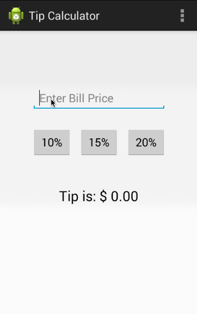

TipCalculator
=============

Android Tip calculator

This is an Android tip calculator application

Time spent: 3 hours spent in total

Completed user stories:

 * [x] Required: EditText can accept text input from user
 * [x] Required: User can click on any tip percent buttons to calculate the tip total 
 * [x] Required: Total tip label text changes after the user activates any tip percent buttons 
 * [x] Optional: Total tip label text shows an error message when the user enters nonnumeric values on the EditText 
 
Notes:

Spent some time getting used to the ADT and git

Walkthrough of all user stories:

GIF created with [LiceCap](http://www.cockos.com/licecap/).
